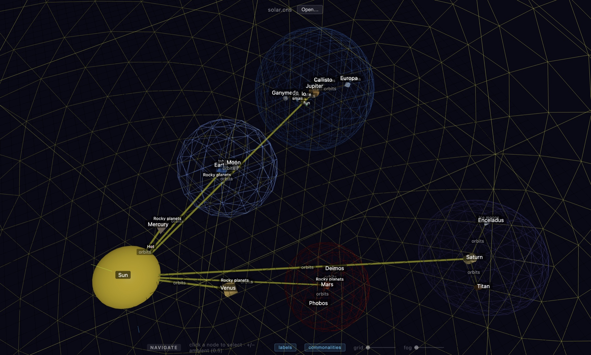

<!--
SPDX-FileCopyrightText: 2026 Gary Frattarola <garyf@parkviewlab.ai>
SPDX-License-Identifier: CC-BY-4.0
-->

# conception-space

Organize your knowledge in space.<BR>
Build navigable places. Shape visible relationships. Discover emergent patterns.



---

A desktop app for organizing knowledge in 3D space. You place nodes by hand at explicit coordinates —
and each node is a **handle onto a real file** (usually a markdown note, sometimes a PDF). Unlike Mermaid
or DOT, layout is **not computed**: you decide where things live, which makes the space spatially
memorable and lets you *see* the shape of your relationships at a glance.

Open a node to read or edit its content; the arrangement becomes a navigable index over your own corpus.
Built with Electron + Three.js; runs on **macOS, Windows, and Linux**.

See [`docs/northstar.md`](docs/northstar.md) for the project's intent.

## Install

Download the installer for your platform from the
[latest release](https://github.com/ParkviewLab/conception-space/releases):

| Platform | File |
|---|---|
| macOS (Apple Silicon) | `.dmg` |
| Windows | `.exe` (installer) |
| Linux | `.AppImage` or `.deb` |

> The **macOS** build is **signed and notarized** (Apple Developer ID), so it installs without warnings.
> The **Windows** and **Linux** builds are not yet code-signed:
> - **Windows:** SmartScreen → **More info** → **Run anyway**.
> - **Linux:** make the AppImage executable first (`chmod +x Conception-Space-*.AppImage`), then run it. The `.deb` installs normally (`sudo dpkg -i`).

## Run from source

```bash
npm ci
npm run dev      # electron-vite dev server with HMR
npm run build    # bundle to out/
npm start        # preview the built app
```

## License

[](LICENSE)
[](https://reuse.software)

conception-space is **dual-licensed**: the code is free software under **AGPL-3.0-or-later** by default,
with a **commercial license** available as an alternative (for closed-source use without the AGPL's
obligations). Documentation is **CC-BY-4.0**; the ParkviewLab logo is proprietary.

**See [LICENSING.md](LICENSING.md)** for the full picture and the commercial-license contact. Canonical
per-license texts live in [`LICENSES/`](LICENSES/) ([REUSE](https://reuse.software)-compliant).

---
<sub>© 2026 Gary Frattarola · part of [ParkviewLab](https://parkviewlab.ai)</sub>
